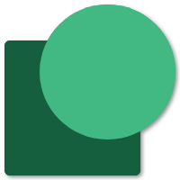

<h1>&nbsp; Vue.js 3 + SASS + Lucide Icons</h1>


A template to start a new project with [Vue.js 3](https://vuejs.org/) + **Vue Router**, SASS and [Lucide Icons](https://lucide.dev/). ESlint and Prettier are also configured.


____
## How to work with this boilerplate

### Project setup
```bash
npm install
```

### Compiles and hot-reloads for development
```bash
npm run dev
```

### Compiles and minifies for production
```bash
npm build
```

### Lints and fixes files
```bash
npm lint
```

### Customize configuration
See [Configuration Reference](https://cli.vuejs.org/config/).

> **Note**
>
> This boilerplate was inspired by Thomas. :)